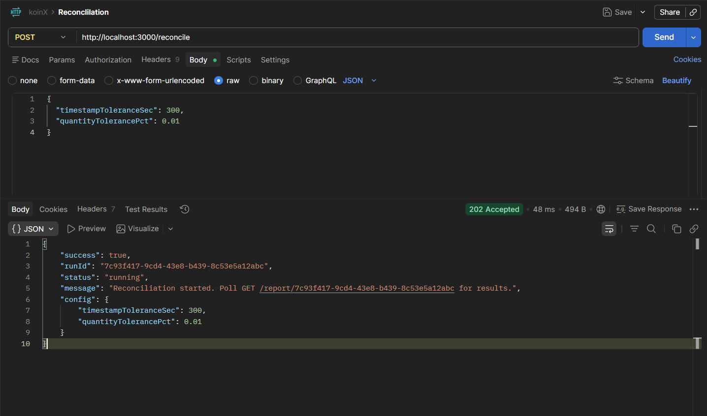
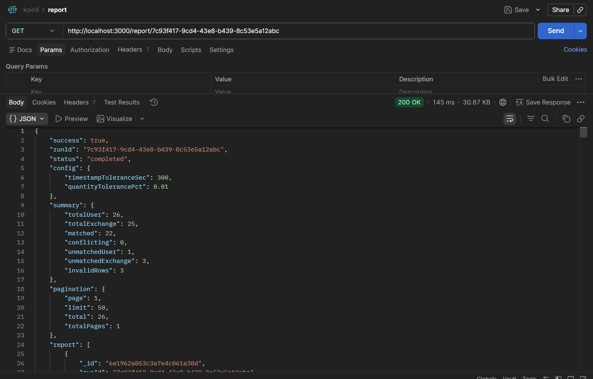
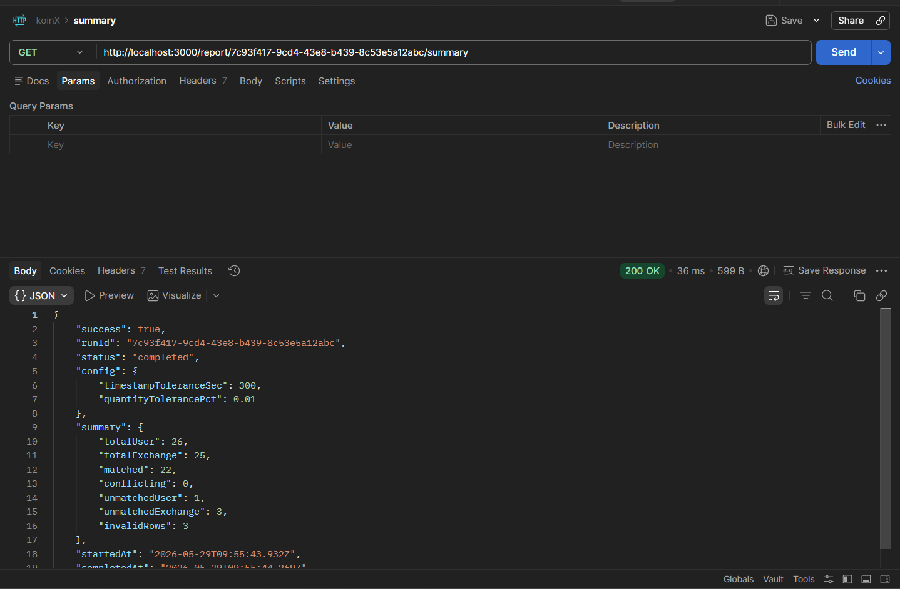
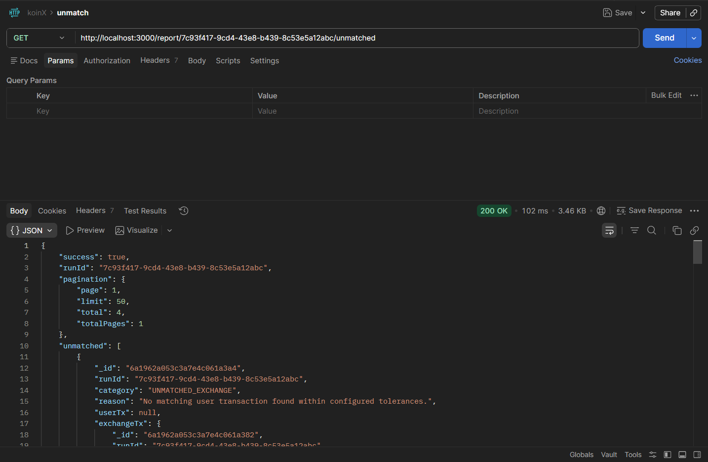

# KoinX — Transaction Reconciliation Engine

A production-grade Node.js backend that ingests two CSV sources of crypto transaction data (user-exported and exchange-exported), matches them using a configurable tolerance engine, and produces structured reconciliation reports via a REST API.

---

## Table of Contents

- [Tech Stack](#tech-stack)
- [Project Structure](#project-structure)
- [Getting Started](#getting-started)
- [Environment Variables](#environment-variables)
- [API Reference](#api-reference)
- [Matching Algorithm](#matching-algorithm)
- [Data Quality Handling](#data-quality-handling)
- [Key Design Decisions](#key-design-decisions)

---

## Tech Stack

| Layer | Technology |
|-------|-----------|
| Runtime | Node.js |
| Framework | Express.js |
| Database | MongoDB (Mongoose ODM) |
| CSV Parsing | csv-parse (streaming) |
| Logging | Winston |
| Validation | Joi |
| Config | dotenv |

---

## Project Structure

```
KoinX-Backend/
├── app.js                    # Express setup, middleware, error handlers
├── server.js                 # DB connection + server start
├── config/
│   └── index.js              # Centralised config (env-driven)
├── models/
│   ├── Transaction.js        # Every ingested CSV row
│   ├── ReconciliationRun.js  # Run metadata + summary counts
│   └── ReconciliationReport.js  # Per-row report output
├── controllers/
│   ├── reconcileController.js
│   └── reportController.js
├── routes/
│   ├── index.js
│   ├── reconcile.routes.js
│   └── report.routes.js
├── services/
│   ├── ingestion.service.js  # CSV → validate → MongoDB
│   ├── matching.service.js   # 3-phase matching algorithm
│   └── report.service.js     # Query + CSV export helpers
├── utils/
│   ├── csvParser.js
│   ├── logger.js
│   ├── assetAliases.js       # BTC=Bitcoin etc.
│   └── typeMapping.js        # TRANSFER_IN ↔ TRANSFER_OUT
└── data/
    ├── user_transactions.csv
    └── exchange_transactions.csv
```

---

## Getting Started

### Prerequisites

- Node.js v18+
- MongoDB running locally or a MongoDB Atlas connection string

### Installation

```bash
# 1. Clone the repository
git clone <your-repo-url>
cd KoinX-Backend

# 2. Install dependencies
npm install

# 3. Configure environment
cp .env.example .env
# Edit .env with your MongoDB URI and any tolerance overrides

# 4. Start the server
npm run dev       # development (nodemon)
npm start         # production
```

The server starts at `http://localhost:3000` by default.

### Quick Health Check

```bash
curl http://localhost:3000/health
```

---

## Environment Variables

| Variable | Default | Description |
|----------|---------|-------------|
| `PORT` | `3000` | HTTP server port |
| `MONGO_URI` | `mongodb://localhost:27017/koinx` | MongoDB connection string |
| `TIMESTAMP_TOLERANCE_SECONDS` | `300` | Max timestamp diff (seconds) for a proximity match |
| `QUANTITY_TOLERANCE_PCT` | `0.01` | Max quantity % diff (0.01 = 1%) for a proximity match |
| `USER_CSV_PATH` | `./data/user_transactions.csv` | Path to user transactions CSV |
| `EXCHANGE_CSV_PATH` | `./data/exchange_transactions.csv` | Path to exchange transactions CSV |
| `LOG_LEVEL` | `info` | Winston log level |

---

## API Reference

### `POST /reconcile`

Triggers an asynchronous reconciliation run. Returns a `runId` immediately; the caller polls `GET /report/:runId` until `status === "completed"`.

**Request body** (all fields optional):
```json
{
  "timestampToleranceSec": 300,
  "quantityTolerancePct": 0.01
}
```

**Response** `202 Accepted`:
```json
{
  "success": true,
  "runId": "uuid-v4",
  "status": "running",
  "message": "Reconciliation started. Poll GET /report/<runId> for results.",
  "config": { "timestampToleranceSec": 300, "quantityTolerancePct": 0.01 }
}
```

---

### `GET /report/:runId`

Full paginated reconciliation report.

**Query params**: `page` (default 1), `limit` (default 50, max 200), `format=csv`

**Response**:
```json
{
  "success": true,
  "runId": "...",
  "status": "completed",
  "config": { ... },
  "summary": {
    "totalUser": 14,
    "totalExchange": 14,
    "matched": 8,
    "conflicting": 2,
    "unmatchedUser": 3,
    "unmatchedExchange": 2,
    "invalidRows": 3
  },
  "pagination": { "page": 1, "limit": 50, "total": 15, "totalPages": 1 },
  "report": [ { "category": "MATCHED", "reason": "...", "userTx": {...}, "exchangeTx": {...} } ]
}
```

Add `?format=csv` to get a downloadable CSV file.

---

### `GET /report/:runId/summary`

Returns only the counts.

```json
{
  "success": true,
  "runId": "...",
  "status": "completed",
  "summary": { "matched": 8, "conflicting": 2, "unmatchedUser": 3, "unmatchedExchange": 2, "invalidRows": 3 }
}
```

---

### `GET /report/:runId/unmatched`

Returns only unmatched rows (`UNMATCHED_USER` + `UNMATCHED_EXCHANGE`), paginated.

---

## Postman Screenshots

### POST `/reconcile` — Trigger a reconciliation run
> Returns `202 Accepted` immediately with a `runId`.



---

### GET `/report/:runId` — Full report
> Returns the complete paginated report with all categories.



---

### GET `/report/:runId/summary` — Summary counts only
> Quick overview of matched / conflicting / unmatched / invalid counts.



---

### GET `/report/:runId/unmatched` — Unmatched rows only
> Lists only `UNMATCHED_USER` and `UNMATCHED_EXCHANGE` rows with reasons.



---

## Matching Algorithm

The engine runs a **3-phase pipeline**:

### Phase 1 — Exact ID Match
If both a user transaction and an exchange transaction share the same `transaction_id`, they are paired first.
- All key fields within tolerance → **MATCHED**
- Fields differ beyond tolerance → **CONFLICTING**

### Phase 2 — Proximity Match
For remaining unmatched rows, candidates are found by:
1. Same **asset** (normalised — `Bitcoin` = `BTC`)
2. Compatible **type** (direct match OR cross-perspective pair: `TRANSFER_IN` ↔ `TRANSFER_OUT`)
3. **Timestamp** within ±`TIMESTAMP_TOLERANCE_SECONDS`
4. Among candidates, pick the one with the smallest quantity difference
5. Accept only if the best candidate is within `QUANTITY_TOLERANCE_PCT`

### Phase 3 — Unmatched
All remaining user rows → **UNMATCHED_USER**
All remaining exchange rows → **UNMATCHED_EXCHANGE**

---

## Data Quality Handling

Every CSV row is validated. **No rows are silently dropped.** Invalid rows are saved to MongoDB with `isValid: false` and a `qualityFlags` array.

| Flag | Trigger |
|------|---------|
| `MISSING_TX_ID` | No transaction_id field |
| `INVALID_TIMESTAMP` | Missing or unparseable date |
| `MISSING_ASSET` | No asset/currency field |
| `INVALID_QUANTITY` | Non-numeric quantity |
| `NEGATIVE_QUANTITY` | quantity < 0 |
| `INVALID_PRICE` | Non-numeric price |
| `INVALID_FEE` | Non-numeric fee |
| `MISSING_TYPE` | No type field |
| `UNKNOWN_TYPE` | Unrecognised type string |

Invalid rows are excluded from matching but counted in the run summary under `invalidRows`.

---

## Key Design Decisions

### 1. Async Reconciliation (202 Pattern)
`POST /reconcile` returns immediately with a `runId` and runs the pipeline in the background. This is intentional — in production, CSV files can be large and reconciliation can take time. The caller polls `GET /report/:runId` to track progress.

### 2. Nothing Is Dropped
The assignment says "do not silently drop bad rows". Every row — even completely unparseable ones — is saved to MongoDB with its original `rawRow` and `qualityFlags`. This is critical for audit trails.

### 3. Cross-Perspective Type Matching
`TRANSFER_OUT` on the user side and `TRANSFER_IN` on the exchange side represent the **same transaction from opposite perspectives**. The engine treats these as equivalent during Phase 2 matching.

### 4. Asset Normalisation
The engine maps common aliases (`Bitcoin` → `BTC`, `Ethereum` → `ETH`, `Dogecoin` → `DOGE`, etc.) before comparing. All comparisons are case-insensitive.

### 5. Quantity Tolerance as Percentage
Quantity tolerance is expressed as a **percentage** (e.g. `0.01` = 1%) rather than an absolute number, so it scales correctly across assets with vastly different price ranges (0.0001 BTC vs 10,000 DOGE).

### 6. CSV File Source
The engine reads CSVs from a configurable path (`USER_CSV_PATH`, `EXCHANGE_CSV_PATH`) rather than accepting file uploads. This keeps the API simple and mirrors how the assignment frames the problem. File upload support can be added easily.

### 7. CONFLICTING vs UNMATCHED
A row is `CONFLICTING` only when a candidate match **is found** (by ID or proximity) but the fields exceed tolerance. If no candidate match exists at all, the row is `UNMATCHED`. This distinction is meaningful: a conflict indicates a data discrepancy worth investigating, while unmatched indicates a missing record.

### 8. Paginated Report Endpoints
The report endpoints are paginated (default 50 rows/page) to avoid memory issues on large datasets. Add `?format=csv` to `GET /report/:runId` to download the entire report as a flat CSV.
